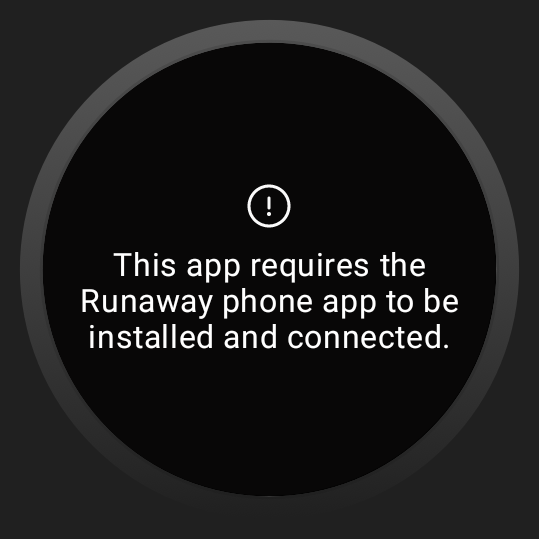
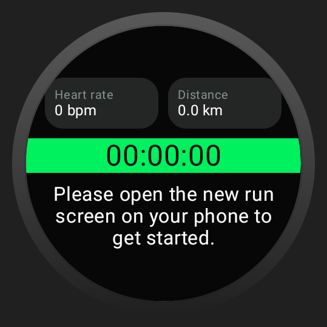
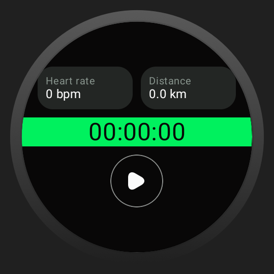
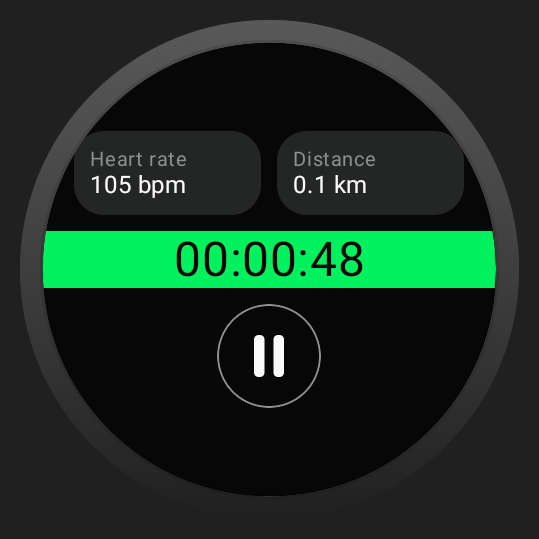
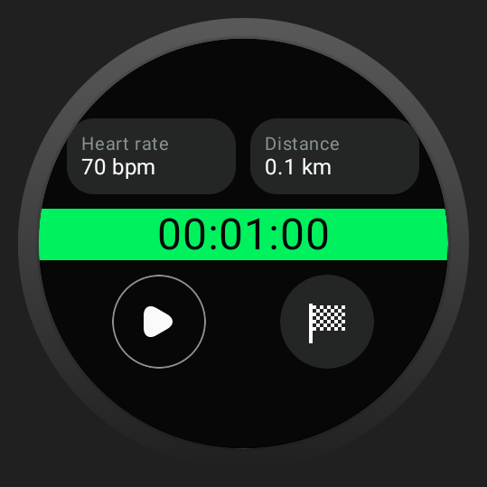
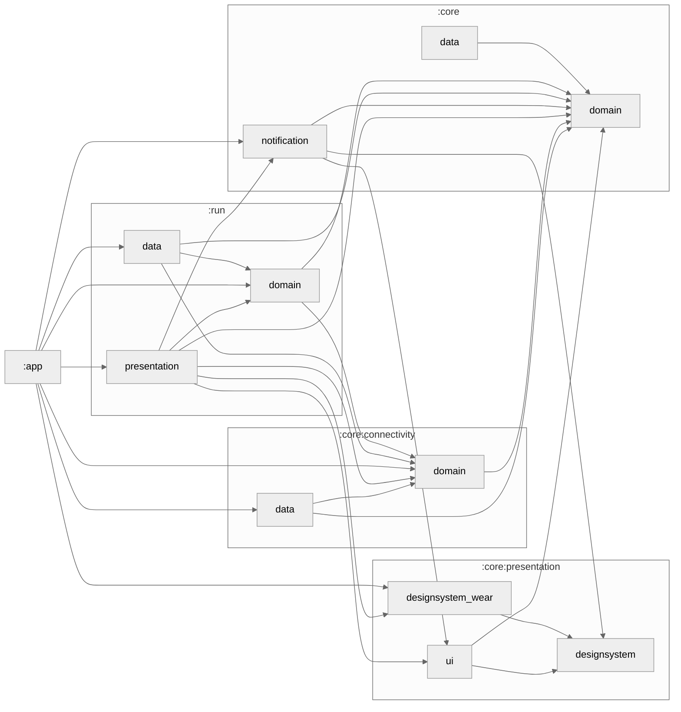

# RunAwayWear app!

**RunAwayWear** is a seamless companion of the **RunAway** mobile app, designed to deliver an intuitive 
and lightweight running tracker experience directly on your wrist. Built with Wear OS, this companion 
app integrates effortlessly with the mobile version, ensuring real-time synchronization and accurate 
tracking of your running stats. Using **Jetpack Compose for Wear OS** and **Kotlin Coroutines**, 
the app maintains the reactive, real-time data handling approach found in the main app, powered 
by **Flow**. Its modular architecture enables scalability and easy maintenance, ensures uninterrupted 
tracking even with a phone connection. Perfect for those on the go, 
the Wear Companion brings the best of modern Android development to your smartwatch, offering a 
practical and responsive running companion.

|  |  |  |  |  |
|----------------------------------------------|----------------------------------------------|----------------------------------------------|----------------------------------------------|----------------------------------------------|

# Build with

| Technology                                                                                     | Description                                                                                       | Version |
|------------------------------------------------------------------------------------------------|---------------------------------------------------------------------------------------------------|---------|
|  | **Jetpack Compose** - Modern toolkit for building native Android UIs using declarative components | Bom 2024.02.02  |
|  | **Kotlin Coroutines** - Asynchronous programming framework for managing background tasks          | 1.8.0   |
|  | **Flow** - Kotlin's reactive streams API for handling data streams and asynchronous operations    | 1.8.0   |
|  | **Navigation Compose** - Navigation library for managing UI navigation in Compose apps            | 2.7.7   |
|  | **Koin** - Lightweight dependency injection framework for Kotlin                                  | 3.5.3   |

> These technologies were selected to ensure efficient, scalable, and modern Android app development.

# Module Graph

# Setup for usage

> To successfully use this wear OS app you need to have main phone app that you can get from:
> [RunAway phone app](https://github.com/galmax1/RunAway)

To build the project, follow these steps:

1. **Open the Project in Android Studio:**
    - Launch Android Studio.
    - Click on `File > Open...` and select the root directory of your project.

2. **Sync Gradle:**
    - Android Studio will automatically detect the Gradle files and sync the project. If not, you
      can manually sync by clicking on `Sync Project with Gradle Files` in the toolbar.

3. **Build the Project:**
    - You can build the project by selecting `Build > Make Project` or by clicking the `Build` icon
      in the toolbar.

