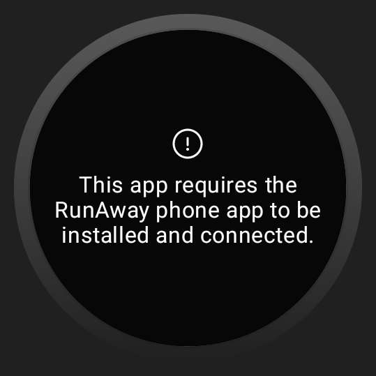

# Welcome to RunAway app!

**RunAway** is a simple yet powerful running tracker app developed as a learning project to explore 
new technologies and approaches in Android development. Built entirely with **Jetpack Compose UI** 
and **Kotlin Coroutines**, the app embraces a reactive approach using **Flow** for real-time data handling. 
It features a **multi-modular architecture** with **Gradle convention plugins** set up to simplify 
module creation and management. Through this project, key industry practices such as **cloud sync**,
**offline-first** functionality, and a scalable structure were implemented, making it a practical tool 
for understanding modern Android development techniques.


|  |  |  |  |  |
|----------------------------------------------|----------------------------------------------|----------------------------------------------|----------------------------------------------|----------------------------------------------|

# Build with

| Technology                                                                                     | Description                                                                                       | Version |
|------------------------------------------------------------------------------------------------|---------------------------------------------------------------------------------------------------|---------|
|  | **Jetpack Compose** - Modern toolkit for building native Android UIs using declarative components | Bom 2024.02.02  |
|  | **Kotlin Coroutines** - Asynchronous programming framework for managing background tasks          | 1.8.0   |
|  | **Flow** - Kotlin's reactive streams API for handling data streams and asynchronous operations    | 1.8.0   |
|  | **Jetpack Room** - Persistence library for local storage using SQLite                             | 2.6.1   |
|  | **Navigation Compose** - Navigation library for managing UI navigation in Compose apps            | 2.7.7   |
|  | **Koin** - Lightweight dependency injection framework for Kotlin                                  | 3.5.3   |
|  | **Ktor** - Framework for building asynchronous servers and clients in Kotlin                      | 2.3.8   |

> These technologies were selected to ensure efficient, scalable, and modern Android app development.

# Module Graph


## Analytics module

This dynamic feature module provides analytics on the total number of runs within the app. 
By using on-demand delivery, it allows users to download and access this feature only when necessary, 
optimizing app size and performance. The module efficiently tracks and analyzes run data, 
offering insights without impacting the core app’s functionality.

# Setup for personal use

To build the project, follow these steps:

1. **Open the Project in Android Studio:**
    - Launch Android Studio.
    - Click on `File > Open...` and select the root directory of your project.

2. **Sync Gradle:**
    - Android Studio will automatically detect the Gradle files and sync the project. If not, you
      can manually sync by clicking on `Sync Project with Gradle Files` in the toolbar.

3. **Add required data:**
    - To successfully build the project you need to specify your own **backend server API key** 
      and **Google Maps Api key** in the local configuration file `local.properties`:
      ```bash
         API_KEY = [Replace with your own API key]
         MAPS_API_KEY = [Replace with your own API key]

4. **Build the Project:**
    - You can build the project by selecting `Build > Make Project` or by clicking the `Build` icon
      in the toolbar.


